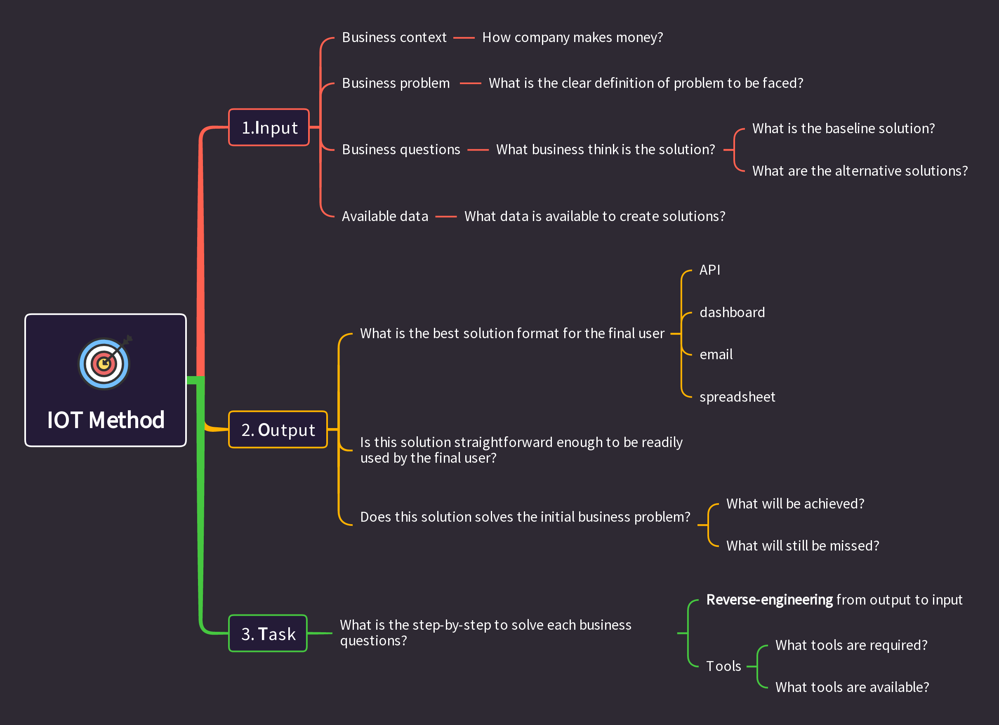
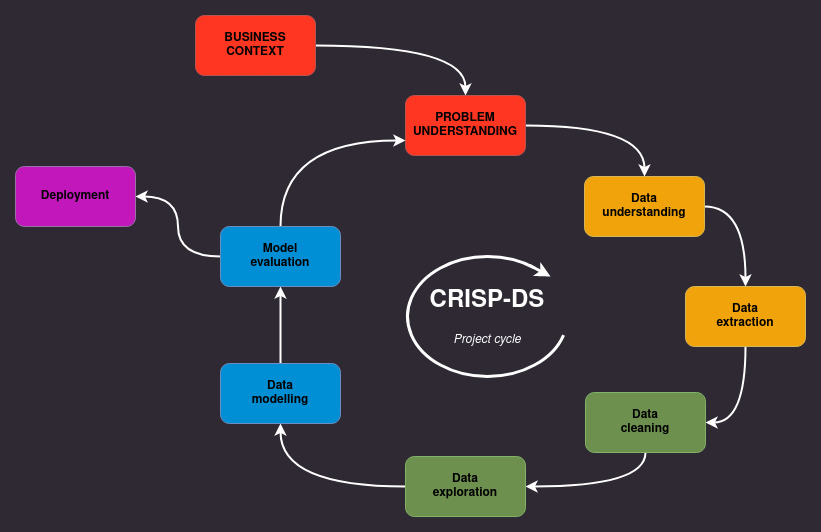

# **PROBLEM SOLVING DESIGN**

# **BUSINESS CONTEXT**
## What is the company?

...

## What is its business model?

...

## What is the company stage on the market?

...

# **BUSINESS PROBLEM**

## What is the business problem the company is facing?

...

## What is the business solution that this project has to deliver?

...

REFERENCES:

...

# **SCOPE AND BUSINESS ASSUMPTIONS**

...

REFERENCES:

...

---

# **SOLUTION DESIGN**

### INPUT

- **Business context**: ...
- **Business problem**: ...
- **Business questions**: ...
- **Available data**: ...

### OUTPUT 

- ...

### TASKs

- ...

---

# **PRODUCT BUILDING ROADMAP**

## Notebook sections

### Step 00. Helpers:
Import libraries, define functions, setup environment and constants

### Setep 01. Data Extraction
Inspect ERD (Entity-Relationship Diagram) and the meaning of the available data as well as extract (and merge, if needed) data from data sources onto dataframes.

### Step 02. Data Description:
Rename columns, check the number of rows and columns, inspect data types, validate data, deal with missing values then do basic summary statistics to get intuition about the data.

## Step 03. Feature Engineering:
Create a hypothesis list to validate on Exploratory Analysis (EDA) and create the required features to EDA as well as for machine learning modelling.

## Step 04. Data Filtering:
Filter rows and columns that do not contain information for modelling or do not match the scope of the business (e.g. predict sales for a closed store).

## Step 05. Exploratory Data Analysis:
Analyse each variable alone (univariate analysis) and the relationship among variables in pairs (bivariate analysis). Then, validate the hypothesis list (one by one) to raise insights. Finally, perform a dimensionality reduction exploration to get intuite if such technique may be helpful for ML modelling.

## Step 06. Data Preparation:
Remove variables that won't be available in the production environment. Split data into train, validation and test datasets. Scale numeric features, encode categorical features, transform target variable (if needed)(e.g. log, sqrt), transform cyclic variables (e.g. day of week, month in year), then double-check all preparation to make sure the data is ready for ML modelling.

## Step 07. Feature Selection:
Inspect difference combination of features (e.g. by means of logistic regression coeficients, random forest feature importance, boruta, mutual information, etc) that may help ML modelling.

## Step 08. Machine Learning Modelling:
Define the metric of success and the health metrics. Define baseline model and its performance metrics then experiment with different ML models (and cross-validation) to select the one with the best performance for the given problem.

## Step 09. Hyperparameter Tuning:
Define the best values for each parameter of the selected ML model (e.g. by means of grid search, random search, bayesian search).

## Step 10. Performance Evaluation and Interpretation:
Check the final performance of the tuned ML model on the training data (check for overfitting and underfitting issues). Then, check the model generalization on validation data and perform error analysis to define if the model is ready for model. Check the production model on the test data and translate the ML performance into business results.

## Step 11. Deployment:
Define the deployment architecture and discuss its requirements as well as alternatives.

# **MAIN EXPLORATORY ANALYSIS INSIGHTS**

- ...
- ...
- ...

# **ML PIPELINE AND METRICS**

- ...
- ...
- ...

# **DEPLOYMENT ARCHTECTURE**

- ...
- ...
- ...

---

# **BUSINESS HYPOTHESIS VALIDATION**

- ...
- ...
- ...

# **MODEL IMPACT REVIEW (MIR)**

- ...
- ...
- ...

# **LIFT OF OPPORTUNITY OVER COST**

- ...
- ...
- ...

# **NEXT STEPS TO IMPROVE**

- ...
- ...
- ...